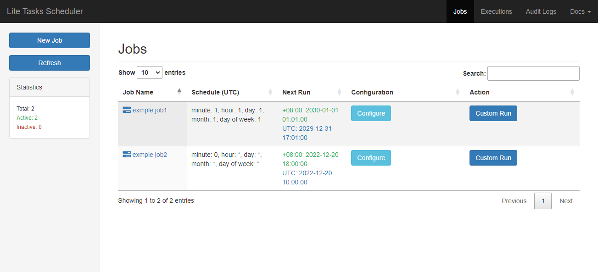
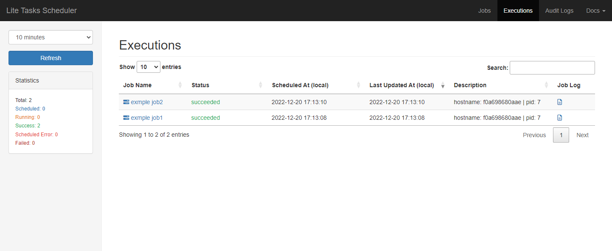
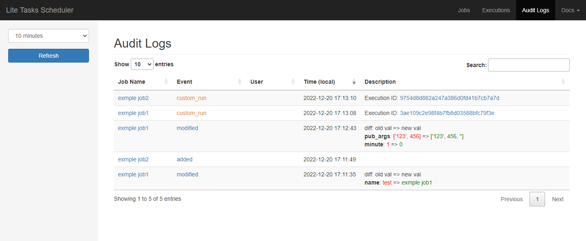
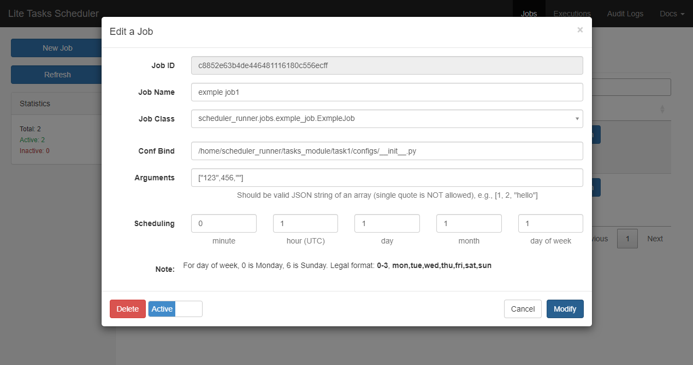
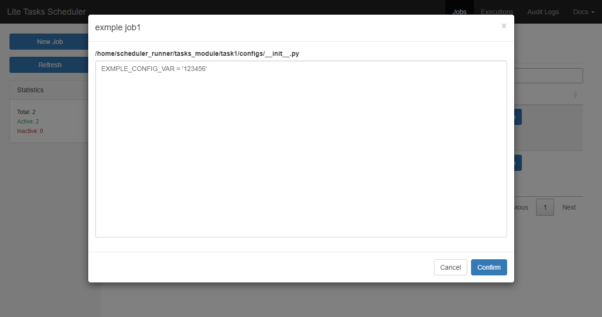

# Lite-tasks-scheduler

 

Fork from ``ndscheduler``,  It's a flexible python library for building your own cron-like system to schedule jobs, which is to run a tornado process to serve REST APIs and a web ui.

**``Lite-tasks-scheduler`` currently supports Python 3.9.6 on Mac OS X / Linux.**

**``Lite-tasks-scheduler`` add configuration feature.**
## Table of contents
  
  * [Key Abstractions](#key-abstractions)
  * [Try it NOW](#try-it-now)
  * [REST APIs](#rest-apis)
  * [Web UI](#web-ui)

## Key Abstractions

* [CoreScheduler](https://github.com/Nextdoor/ndscheduler/tree/master/ndscheduler/corescheduler): encapsulates all core scheduling functionality, and consists of:
  * [Datastore](https://github.com/Nextdoor/ndscheduler/tree/master/ndscheduler/corescheduler/datastore): manages database connections and makes queries; could support Postgres, MySQL, and sqlite.
    * Job: represents a schedule job and decides how to run a paricular job.
    * Execution: represents an instance of job execution.
    * AuditLog: logs when and who runs what job.
  * [ScheduleManager](https://github.com/Nextdoor/ndscheduler/blob/master/ndscheduler/corescheduler/scheduler_manager.py): access Datastore to manage jobs, i.e., schedule/modify/delete/pause/resume a job.
* [Server](https://github.com/Nextdoor/ndscheduler/tree/master/ndscheduler/server): a tornado server that runs ScheduleManager and provides REST APIs and serves UI.
* [Web UI](https://github.com/Nextdoor/ndscheduler/tree/master/ndscheduler/static): a single page HTML app; this is a default implementation.

Note: ``corescheduler`` can also be used independently within your own service if you use a different Tornado server / Web UI.

## Try it NOW

From source code:

    git clone https://github.com/shuhanghang/lite-tasks-scheduler.git
    pip3 install -r requirements.txt
    sh entrypoint.sh

Or use docker:
    
    docker build -t shuhanghang/lite-tasks-scheduler:latest .
    docker run -it -p 8888:8888 shuhanghang/lite-tasks-scheduler:latest
    
Open your browser and go to [localhost:8888](http://localhost:8888). 

## REST APIs

Please see [README.md in ndscheduler/server/handlers](https://github.com/Nextdoor/ndscheduler/blob/master/ndscheduler/server/handlers/README.md).

## Web UI

We provide a default implementation of web ui. You can replace the default web ui by overwriting these settings

    STATIC_DIR_PATH = :static asset directory paths:
    TEMPLATE_DIR_PATH = :template directory path:
    APP_INDEX_PAGE = :the file name of the single page app's html:
    
### The default web ui

**List of jobs**

**List of executions**

**Audit Logs**

**Modify a job**

**Configure a job**
